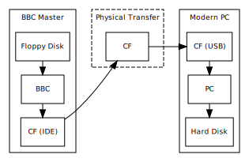

In 2007, we were given a small set of 5¼' floppy disks from a BBC Master, and asked if we could recover the data and make it usable. Eventually, in 2009, we began working on this in earnest, and this document covers what we learned as we did so.

Hardware
--------

[INSERT PICTURE OF KIT]

We already had a special BBC Master that had been fitted [this with clever CompactFlash drive kit][1], which we had purchased for experimentation purposes earlier on. This device allows a relatively modern media type to be accessed on the BBC as if it were an IDE a hard disk. Once data has been written to the flash drive, it can be can be physicallyu transferred to a modern PC and accessed via a standard CompactFlash reader. This provided a complete chain of hardware, making the transfer possible, at least in principle. The software side turned our to be far more complex.

Migration
---------

[INSERT IMAGE OF BACKUP PROCESS RUNNING]

Clearly, we wanted to minimise how hard we worked the disks, and so we aimed to clone the contents of the disk as a complete disk image as a one-off process, rather than access the data on the disks directly. Fortunately a [BBC BASIC program exists that is able to do this], and came included on the CF drive. VERSION? Unfortunately, it wasn't clear if the disk was a 40 or 80 track disk, so we had to try both. Nervously, I ran the program, and the drive chugged away, producing a noise that filled me with nostalgia.

[Floppy] -> [BACKUP] -> [Floppy Disk Images] -> [BBC Master] -> [CF] -> [PC] -> [Disk Images]

At this point, we had a disk image on the CF drive, and could take it our and transfer it to a PC. Unfortunately, Windows does not recognise the DFS disk format that the BBC needs, so the CF disk had to be directly imaged (an image with an image inside!), and then read using ADFSExplorer (which is a little buggy - disk image updates don't really work, full extraction needed). Finally, we had the disk image on the PC, and we could hook it up to [a suitable emulator|BeebEm?] and explore the contents.

[Floppy] -> [BACKUP] -> [Floppy Disk Images] -> [BBC Master] -> [CF] -> [PC] -> [Hard Disk Image] -> [ADFSExplorer] -> [Disk Images] -> [BeebEm]

Emulation
---------

But it didn't work. The file listing looked okay, but when booting the disk, the system kept failing mysteriously. Did something go wrong along this long chain of migration? Or was the condition of the disk itself the problem? To find out, we went back to the BBC and tried to read other disks, including one containing the Elite game, as this was believed to be in good condition and is one where we know what the performance should be like. We didn't want to fire up the disk we were given and explore the contents of it.

[Floppy] -> [BACKUP] -> [Floppy Disk Images] -> [BBC Master] -> [CF] -> [PC] -> [Hard Disk Image] -> [ADFSExplorer] -> [Disk Images] -> [BeebEm] -> [FAILURE]

Elite appeared to run perfectly on the BBC itself, but the cloned disk image failed consistently. We were stuck.

Guesswork
---------

Some months later, after once more searching and looking for possible alternatives for recovery, I found this hint that disk images are sometimes interlaced, on 20B boundaries. Guessing that this might be the issue, I wrote a small Java program that would de-interlace the data. The guess paid off, and Elite booted at last.

[Floppy] -> [BACKUP] -> [Floppy Disk Images] -> [BBC Master] -> [CF] -> [PC] -> [Hard Disk Image] -> [ADFSExplorer] -> [Disk Images] -> [DeInterlace Process] -> [BeebEm]

Finally, I could open up the disk we had been given. It appeared to be a ViewStore data file, but we did not have any of that software, so we could not make full use of the data. However, we passed the disk image back to the contributor and they appeared to be happy with our efforts.

Summary
-------

Having learned more about this type of work, we would use Kryoflux or similar as a safer way of ripping the disk image (although once this is done, having the original hardware around is very helpful for determining what is supposed to happen!). While this change would make the migration chain shorter, it is still too much guess work involved.

Given that is has proven possible to access the data, some might argue that the floppy disks and the data on them are not obsolete. I would say that this long, brittle chains of migration and extensive guesswork are exactly what obsolescence looks like. Is is the slow death of a thousand ambiguities, rather than an sudden, jarring expiration. Obsolescence is approached, rather than attained, with the costs of access rising every step of the way.

[1]: http://www.retroclinic.com/acorn/kitide1mhz/kitide1mhz.htm
