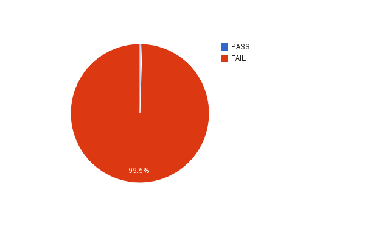

Introduction
------------

JHOVE's [PDF-hul page](http://jhove.sourceforge.net/pdf-hul.html#coverage) claims it is capable of validating PDF/A files. Later on in that document, it admits a lesser claim:

> Note that the PDF module does not parse the contents on streams, so it cannot determine conformance to PDF/A to the degree required by the ISO standard.

So, I thought it might be interesting to test how well JHOVE validated PDF/A documents. Sadly, we do not yet have a full compliance testing corpus for PDF, but [there is one for non-compliance with PDF/A-1b](http://www.pdfa.org/2011/08/download-isartor-test-suite/).

The Isartor test suite is an excellent resource, and exactly the kind of thing we could use more of in digital preservation. It is composed of a set of PDF files, each of which carefully and systematically violates the PDF/A-1b standard.

[PDF/A-1b](http://www.digitalpreservation.gov/formats/fdd/fdd000252.shtml) is the lowest level of PDF/A compliance, and the test suite only covers failure cases rather than passes. This makes things somewhat easier on the tools, as they only have to avoid false-positive validations at the minimal level of compliance, but it is still a very useful baseline test.

If JHOVE can validate PDF/A-1b, then every PDF in that test suite should fail JHOVE validation.

Method
------

I used JHOVE 1.11[^1], installed on my Mac via Homebrew. I made scripts to [run JHOVE and store the output](./pdfa/run-jhove.sh), and to [do the same for all the files](./pdfa/jhove-all-files.sh). Once I had the JHOVE output, I tabulated and graphed the results.

<!--
     grep --text " Status:" pdfa/isartor-flat-testsuite/*.jhove-1.11.txt | sort > pdfa/results.1-11.txt
-->

Results
-------

Here is a summary of the results, showing how many of the PDF/A-1b test files JHOVE correctly determined to be invalid:

That 99.5% failure rate means JHOVE only managed to detect one invalid PDF/A-1b file from this set of 204 invalid files. The full, raw JHOVE results are available [below](#appendix).

Conclusion
----------

Don't use JHOVE to validate PDF/A.

Maybe try [Apache Preflight](https://pdfbox.apache.org/cookbook/pdfavalidation.html) instead.

Appendix
--------

|----+----|
| Link to full results | JHOVE Status |
|----+----|
| [isartor-6-1-2-t01-fail-a.pdf](./pdfa/isartor-flat-testsuite/isartor-6-1-2-t01-fail-a.pdf.jhove-1.11.txt) | Status: Not well-formed |
| [isartor-6-1-2-t02-fail-a.pdf](./pdfa/isartor-flat-testsuite/isartor-6-1-2-t02-fail-a.pdf.jhove-1.11.txt) | Status: Well-Formed and valid |
| [isartor-6-1-3-t01-fail-a.pdf](./pdfa/isartor-flat-testsuite/isartor-6-1-3-t01-fail-a.pdf.jhove-1.11.txt) | Status: Well-Formed and valid |
| [isartor-6-1-3-t02-fail-a.pdf](./pdfa/isartor-flat-testsuite/isartor-6-1-3-t02-fail-a.pdf.jhove-1.11.txt) | Status: Well-Formed and valid |
| [isartor-6-1-3-t03-fail-a.pdf](./pdfa/isartor-flat-testsuite/isartor-6-1-3-t03-fail-a.pdf.jhove-1.11.txt) | Status: Well-Formed and valid |
| [isartor-6-1-3-t04-fail-a.pdf](./pdfa/isartor-flat-testsuite/isartor-6-1-3-t04-fail-a.pdf.jhove-1.11.txt) | Status: Well-Formed and valid |
| [isartor-6-1-4-t01-fail-a.pdf](./pdfa/isartor-flat-testsuite/isartor-6-1-4-t01-fail-a.pdf.jhove-1.11.txt) | Status: Well-Formed and valid |
| [isartor-6-1-4-t02-fail-a.pdf](./pdfa/isartor-flat-testsuite/isartor-6-1-4-t02-fail-a.pdf.jhove-1.11.txt) | Status: Well-Formed and valid |
| [isartor-6-1-6-t01-fail-a.pdf](./pdfa/isartor-flat-testsuite/isartor-6-1-6-t01-fail-a.pdf.jhove-1.11.txt) | Status: Well-Formed and valid |
| [isartor-6-1-7-t01-fail-a.pdf](./pdfa/isartor-flat-testsuite/isartor-6-1-7-t01-fail-a.pdf.jhove-1.11.txt) | Status: Well-Formed and valid |
| [isartor-6-1-7-t02-fail-a.pdf](./pdfa/isartor-flat-testsuite/isartor-6-1-7-t02-fail-a.pdf.jhove-1.11.txt) | Status: Well-Formed and valid |
| [isartor-6-1-7-t03-fail-a.pdf](./pdfa/isartor-flat-testsuite/isartor-6-1-7-t03-fail-a.pdf.jhove-1.11.txt) | Status: Well-Formed and valid |
| [isartor-6-1-7-t04-fail-a.pdf](./pdfa/isartor-flat-testsuite/isartor-6-1-7-t04-fail-a.pdf.jhove-1.11.txt) | Status: Well-Formed and valid |
| [isartor-6-1-7-t04-fail-b.pdf](./pdfa/isartor-flat-testsuite/isartor-6-1-7-t04-fail-b.pdf.jhove-1.11.txt) | Status: Well-Formed and valid |
| [isartor-6-1-7-t04-fail-c.pdf](./pdfa/isartor-flat-testsuite/isartor-6-1-7-t04-fail-c.pdf.jhove-1.11.txt) | Status: Well-Formed and valid |
| [isartor-6-1-8-t01-fail-a.pdf](./pdfa/isartor-flat-testsuite/isartor-6-1-8-t01-fail-a.pdf.jhove-1.11.txt) | Status: Well-Formed and valid |
| [isartor-6-1-8-t02-fail-a.pdf](./pdfa/isartor-flat-testsuite/isartor-6-1-8-t02-fail-a.pdf.jhove-1.11.txt) | Status: Well-Formed and valid |
| [isartor-6-1-8-t03-fail-a.pdf](./pdfa/isartor-flat-testsuite/isartor-6-1-8-t03-fail-a.pdf.jhove-1.11.txt) | Status: Well-Formed and valid |
| [isartor-6-1-8-t04-fail-a.pdf](./pdfa/isartor-flat-testsuite/isartor-6-1-8-t04-fail-a.pdf.jhove-1.11.txt) | Status: Well-Formed and valid |
| [isartor-6-1-8-t05-fail-a.pdf](./pdfa/isartor-flat-testsuite/isartor-6-1-8-t05-fail-a.pdf.jhove-1.11.txt) | Status: Well-Formed and valid |
| [isartor-6-1-8-t06-fail-a.pdf](./pdfa/isartor-flat-testsuite/isartor-6-1-8-t06-fail-a.pdf.jhove-1.11.txt) | Status: Well-Formed and valid |
| [isartor-6-1-10-t01-fail-a.pdf](./pdfa/isartor-flat-testsuite/isartor-6-1-10-t01-fail-a.pdf.jhove-1.11.txt) | Status: Well-Formed and valid |
| [isartor-6-1-10-t01-fail-b.pdf](./pdfa/isartor-flat-testsuite/isartor-6-1-10-t01-fail-b.pdf.jhove-1.11.txt) | Status: Well-Formed and valid |
| [isartor-6-1-10-t01-fail-c.pdf](./pdfa/isartor-flat-testsuite/isartor-6-1-10-t01-fail-c.pdf.jhove-1.11.txt) | Status: Well-Formed and valid |
| [isartor-6-1-11-t01-fail-a.pdf](./pdfa/isartor-flat-testsuite/isartor-6-1-11-t01-fail-a.pdf.jhove-1.11.txt) | Status: Well-Formed and valid |
| [isartor-6-1-11-t02-fail-a.pdf](./pdfa/isartor-flat-testsuite/isartor-6-1-11-t02-fail-a.pdf.jhove-1.11.txt) | Status: Well-Formed and valid |
| [isartor-6-1-12-t01-fail-a.pdf](./pdfa/isartor-flat-testsuite/isartor-6-1-12-t01-fail-a.pdf.jhove-1.11.txt) | Status: Well-Formed and valid |
| [isartor-6-1-12-t01-fail-b.pdf](./pdfa/isartor-flat-testsuite/isartor-6-1-12-t01-fail-b.pdf.jhove-1.11.txt) | Status: Well-Formed and valid |
| [isartor-6-1-12-t01-fail-c.pdf](./pdfa/isartor-flat-testsuite/isartor-6-1-12-t01-fail-c.pdf.jhove-1.11.txt) | Status: Well-Formed and valid |
| [isartor-6-1-12-t01-fail-d.pdf](./pdfa/isartor-flat-testsuite/isartor-6-1-12-t01-fail-d.pdf.jhove-1.11.txt) | Status: Well-Formed and valid |
| [isartor-6-1-13-t01-fail-a.pdf](./pdfa/isartor-flat-testsuite/isartor-6-1-13-t01-fail-a.pdf.jhove-1.11.txt) | Status: Well-Formed and valid |
| [isartor-6-2-10-t01-fail-a.pdf](./pdfa/isartor-flat-testsuite/isartor-6-2-10-t01-fail-a.pdf.jhove-1.11.txt) | Status: Well-Formed and valid |
| [isartor-6-2-10-t01-fail-b.pdf](./pdfa/isartor-flat-testsuite/isartor-6-2-10-t01-fail-b.pdf.jhove-1.11.txt) | Status: Well-Formed and valid |
| [isartor-6-2-10-t01-fail-c.pdf](./pdfa/isartor-flat-testsuite/isartor-6-2-10-t01-fail-c.pdf.jhove-1.11.txt) | Status: Well-Formed and valid |
| [isartor-6-2-2-t01-fail-a.pdf](./pdfa/isartor-flat-testsuite/isartor-6-2-2-t01-fail-a.pdf.jhove-1.11.txt) | Status: Well-Formed and valid |
| [isartor-6-2-2-t02-fail-a.pdf](./pdfa/isartor-flat-testsuite/isartor-6-2-2-t02-fail-a.pdf.jhove-1.11.txt) | Status: Well-Formed and valid |
| [isartor-6-2-2-t02-fail-b.pdf](./pdfa/isartor-flat-testsuite/isartor-6-2-2-t02-fail-b.pdf.jhove-1.11.txt) | Status: Well-Formed and valid |
| [isartor-6-2-2-t03-fail-a.pdf](./pdfa/isartor-flat-testsuite/isartor-6-2-2-t03-fail-a.pdf.jhove-1.11.txt) | Status: Well-Formed and valid |
| [isartor-6-2-3-3-t01-fail-a.pdf](./pdfa/isartor-flat-testsuite/isartor-6-2-3-3-t01-fail-a.pdf.jhove-1.11.txt) | Status: Well-Formed and valid |
| [isartor-6-2-3-3-t02-fail-a.pdf](./pdfa/isartor-flat-testsuite/isartor-6-2-3-3-t02-fail-a.pdf.jhove-1.11.txt) | Status: Well-Formed and valid |
| [isartor-6-2-3-3-t02-fail-b.pdf](./pdfa/isartor-flat-testsuite/isartor-6-2-3-3-t02-fail-b.pdf.jhove-1.11.txt) | Status: Well-Formed and valid |
| [isartor-6-2-3-3-t02-fail-c.pdf](./pdfa/isartor-flat-testsuite/isartor-6-2-3-3-t02-fail-c.pdf.jhove-1.11.txt) | Status: Well-Formed and valid |
| [isartor-6-2-3-3-t02-fail-d.pdf](./pdfa/isartor-flat-testsuite/isartor-6-2-3-3-t02-fail-d.pdf.jhove-1.11.txt) | Status: Well-Formed and valid |
| [isartor-6-2-3-3-t02-fail-e.pdf](./pdfa/isartor-flat-testsuite/isartor-6-2-3-3-t02-fail-e.pdf.jhove-1.11.txt) | Status: Well-Formed and valid |
| [isartor-6-2-3-3-t02-fail-f.pdf](./pdfa/isartor-flat-testsuite/isartor-6-2-3-3-t02-fail-f.pdf.jhove-1.11.txt) | Status: Well-Formed and valid |
| [isartor-6-2-3-3-t02-fail-g.pdf](./pdfa/isartor-flat-testsuite/isartor-6-2-3-3-t02-fail-g.pdf.jhove-1.11.txt) | Status: Well-Formed and valid |
| [isartor-6-2-3-3-t02-fail-h.pdf](./pdfa/isartor-flat-testsuite/isartor-6-2-3-3-t02-fail-h.pdf.jhove-1.11.txt) | Status: Well-Formed and valid |
| [isartor-6-2-3-3-t02-fail-i.pdf](./pdfa/isartor-flat-testsuite/isartor-6-2-3-3-t02-fail-i.pdf.jhove-1.11.txt) | Status: Well-Formed and valid |
| [isartor-6-2-3-3-t02-fail-j.pdf](./pdfa/isartor-flat-testsuite/isartor-6-2-3-3-t02-fail-j.pdf.jhove-1.11.txt) | Status: Well-Formed and valid |
| [isartor-6-2-3-3-t03-fail-a.pdf](./pdfa/isartor-flat-testsuite/isartor-6-2-3-3-t03-fail-a.pdf.jhove-1.11.txt) | Status: Well-Formed and valid |
| [isartor-6-2-3-3-t03-fail-b.pdf](./pdfa/isartor-flat-testsuite/isartor-6-2-3-3-t03-fail-b.pdf.jhove-1.11.txt) | Status: Well-Formed and valid |
| [isartor-6-2-3-3-t03-fail-c.pdf](./pdfa/isartor-flat-testsuite/isartor-6-2-3-3-t03-fail-c.pdf.jhove-1.11.txt) | Status: Well-Formed and valid |
| [isartor-6-2-3-3-t03-fail-d.pdf](./pdfa/isartor-flat-testsuite/isartor-6-2-3-3-t03-fail-d.pdf.jhove-1.11.txt) | Status: Well-Formed and valid |
| [isartor-6-2-3-3-t03-fail-e.pdf](./pdfa/isartor-flat-testsuite/isartor-6-2-3-3-t03-fail-e.pdf.jhove-1.11.txt) | Status: Well-Formed and valid |
| [isartor-6-2-3-3-t04-fail-a.pdf](./pdfa/isartor-flat-testsuite/isartor-6-2-3-3-t04-fail-a.pdf.jhove-1.11.txt) | Status: Well-Formed and valid |
| [isartor-6-2-3-3-t04-fail-b.pdf](./pdfa/isartor-flat-testsuite/isartor-6-2-3-3-t04-fail-b.pdf.jhove-1.11.txt) | Status: Well-Formed and valid |
| [isartor-6-2-3-3-t04-fail-c.pdf](./pdfa/isartor-flat-testsuite/isartor-6-2-3-3-t04-fail-c.pdf.jhove-1.11.txt) | Status: Well-Formed and valid |
| [isartor-6-2-3-3-t04-fail-d.pdf](./pdfa/isartor-flat-testsuite/isartor-6-2-3-3-t04-fail-d.pdf.jhove-1.11.txt) | Status: Well-Formed and valid |
| [isartor-6-2-3-3-t05-fail-a.pdf](./pdfa/isartor-flat-testsuite/isartor-6-2-3-3-t05-fail-a.pdf.jhove-1.11.txt) | Status: Well-Formed and valid |
| [isartor-6-2-3-3-t05-fail-b.pdf](./pdfa/isartor-flat-testsuite/isartor-6-2-3-3-t05-fail-b.pdf.jhove-1.11.txt) | Status: Well-Formed and valid |
| [isartor-6-2-3-4-t01-fail-a.pdf](./pdfa/isartor-flat-testsuite/isartor-6-2-3-4-t01-fail-a.pdf.jhove-1.11.txt) | Status: Well-Formed and valid |
| [isartor-6-2-3-4-t01-fail-b.pdf](./pdfa/isartor-flat-testsuite/isartor-6-2-3-4-t01-fail-b.pdf.jhove-1.11.txt) | Status: Well-Formed and valid |
| [isartor-6-2-4-t01-fail-a.pdf](./pdfa/isartor-flat-testsuite/isartor-6-2-4-t01-fail-a.pdf.jhove-1.11.txt) | Status: Well-Formed and valid |
| [isartor-6-2-4-t02-fail-a.pdf](./pdfa/isartor-flat-testsuite/isartor-6-2-4-t02-fail-a.pdf.jhove-1.11.txt) | Status: Well-Formed and valid |
| [isartor-6-2-4-t03-fail-a.pdf](./pdfa/isartor-flat-testsuite/isartor-6-2-4-t03-fail-a.pdf.jhove-1.11.txt) | Status: Well-Formed and valid |
| [isartor-6-2-4-t04-fail-a.pdf](./pdfa/isartor-flat-testsuite/isartor-6-2-4-t04-fail-a.pdf.jhove-1.11.txt) | Status: Well-Formed and valid |
| [isartor-6-2-5-t01-fail-a.pdf](./pdfa/isartor-flat-testsuite/isartor-6-2-5-t01-fail-a.pdf.jhove-1.11.txt) | Status: Well-Formed and valid |
| [isartor-6-2-6-t01-fail-a.pdf](./pdfa/isartor-flat-testsuite/isartor-6-2-6-t01-fail-a.pdf.jhove-1.11.txt) | Status: Well-Formed and valid |
| [isartor-6-2-7-t01-fail-a.pdf](./pdfa/isartor-flat-testsuite/isartor-6-2-7-t01-fail-a.pdf.jhove-1.11.txt) | Status: Well-Formed and valid |
| [isartor-6-2-7-t02-fail-a.pdf](./pdfa/isartor-flat-testsuite/isartor-6-2-7-t02-fail-a.pdf.jhove-1.11.txt) | Status: Well-Formed and valid |
| [isartor-6-2-8-t01-fail-a.pdf](./pdfa/isartor-flat-testsuite/isartor-6-2-8-t01-fail-a.pdf.jhove-1.11.txt) | Status: Well-Formed and valid |
| [isartor-6-2-8-t01-fail-b.pdf](./pdfa/isartor-flat-testsuite/isartor-6-2-8-t01-fail-b.pdf.jhove-1.11.txt) | Status: Well-Formed and valid |
| [isartor-6-2-8-t01-fail-c.pdf](./pdfa/isartor-flat-testsuite/isartor-6-2-8-t01-fail-c.pdf.jhove-1.11.txt) | Status: Well-Formed and valid |
| [isartor-6-2-8-t01-fail-d.pdf](./pdfa/isartor-flat-testsuite/isartor-6-2-8-t01-fail-d.pdf.jhove-1.11.txt) | Status: Well-Formed and valid |
| [isartor-6-2-8-t02-fail-a.pdf](./pdfa/isartor-flat-testsuite/isartor-6-2-8-t02-fail-a.pdf.jhove-1.11.txt) | Status: Well-Formed and valid |
| [isartor-6-2-8-t02-fail-b.pdf](./pdfa/isartor-flat-testsuite/isartor-6-2-8-t02-fail-b.pdf.jhove-1.11.txt) | Status: Well-Formed and valid |
| [isartor-6-2-8-t02-fail-c.pdf](./pdfa/isartor-flat-testsuite/isartor-6-2-8-t02-fail-c.pdf.jhove-1.11.txt) | Status: Well-Formed and valid |
| [isartor-6-2-9-t01-fail-a.pdf](./pdfa/isartor-flat-testsuite/isartor-6-2-9-t01-fail-a.pdf.jhove-1.11.txt) | Status: Well-Formed and valid |
| [isartor-6-3-2-t01-fail-a.pdf](./pdfa/isartor-flat-testsuite/isartor-6-3-2-t01-fail-a.pdf.jhove-1.11.txt) | Status: Well-Formed and valid |
| [isartor-6-3-2-t01-fail-b.pdf](./pdfa/isartor-flat-testsuite/isartor-6-3-2-t01-fail-b.pdf.jhove-1.11.txt) | Status: Well-Formed and valid |
| [isartor-6-3-2-t01-fail-c.pdf](./pdfa/isartor-flat-testsuite/isartor-6-3-2-t01-fail-c.pdf.jhove-1.11.txt) | Status: Well-Formed and valid |
| [isartor-6-3-3-1-t01-fail-a.pdf](./pdfa/isartor-flat-testsuite/isartor-6-3-3-1-t01-fail-a.pdf.jhove-1.11.txt) | Status: Well-Formed and valid |
| [isartor-6-3-3-1-t01-fail-b.pdf](./pdfa/isartor-flat-testsuite/isartor-6-3-3-1-t01-fail-b.pdf.jhove-1.11.txt) | Status: Well-Formed and valid |
| [isartor-6-3-3-2-t01-fail-a.pdf](./pdfa/isartor-flat-testsuite/isartor-6-3-3-2-t01-fail-a.pdf.jhove-1.11.txt) | Status: Well-Formed and valid |
| [isartor-6-3-3-3-t01-fail-a.pdf](./pdfa/isartor-flat-testsuite/isartor-6-3-3-3-t01-fail-a.pdf.jhove-1.11.txt) | Status: Well-Formed and valid |
| [isartor-6-3-3-3-t02-fail-a.pdf](./pdfa/isartor-flat-testsuite/isartor-6-3-3-3-t02-fail-a.pdf.jhove-1.11.txt) | Status: Well-Formed and valid |
| [isartor-6-3-4-t01-fail-a.pdf](./pdfa/isartor-flat-testsuite/isartor-6-3-4-t01-fail-a.pdf.jhove-1.11.txt) | Status: Well-Formed and valid |
| [isartor-6-3-4-t01-fail-b.pdf](./pdfa/isartor-flat-testsuite/isartor-6-3-4-t01-fail-b.pdf.jhove-1.11.txt) | Status: Well-Formed and valid |
| [isartor-6-3-4-t01-fail-c.pdf](./pdfa/isartor-flat-testsuite/isartor-6-3-4-t01-fail-c.pdf.jhove-1.11.txt) | Status: Well-Formed and valid |
| [isartor-6-3-4-t01-fail-d.pdf](./pdfa/isartor-flat-testsuite/isartor-6-3-4-t01-fail-d.pdf.jhove-1.11.txt) | Status: Well-Formed and valid |
| [isartor-6-3-4-t01-fail-e.pdf](./pdfa/isartor-flat-testsuite/isartor-6-3-4-t01-fail-e.pdf.jhove-1.11.txt) | Status: Well-Formed and valid |
| [isartor-6-3-4-t01-fail-f.pdf](./pdfa/isartor-flat-testsuite/isartor-6-3-4-t01-fail-f.pdf.jhove-1.11.txt) | Status: Well-Formed and valid |
| [isartor-6-3-4-t01-fail-g.pdf](./pdfa/isartor-flat-testsuite/isartor-6-3-4-t01-fail-g.pdf.jhove-1.11.txt) | Status: Well-Formed and valid |
| [isartor-6-3-4-t01-fail-h.pdf](./pdfa/isartor-flat-testsuite/isartor-6-3-4-t01-fail-h.pdf.jhove-1.11.txt) | Status: Well-Formed and valid |
| [isartor-6-3-5-t01-fail-a.pdf](./pdfa/isartor-flat-testsuite/isartor-6-3-5-t01-fail-a.pdf.jhove-1.11.txt) | Status: Well-Formed and valid |
| [isartor-6-3-5-t01-fail-b.pdf](./pdfa/isartor-flat-testsuite/isartor-6-3-5-t01-fail-b.pdf.jhove-1.11.txt) | Status: Well-Formed and valid |
| [isartor-6-3-5-t01-fail-c.pdf](./pdfa/isartor-flat-testsuite/isartor-6-3-5-t01-fail-c.pdf.jhove-1.11.txt) | Status: Well-Formed and valid |
| [isartor-6-3-5-t01-fail-d.pdf](./pdfa/isartor-flat-testsuite/isartor-6-3-5-t01-fail-d.pdf.jhove-1.11.txt) | Status: Well-Formed and valid |
| [isartor-6-3-5-t02-fail-a.pdf](./pdfa/isartor-flat-testsuite/isartor-6-3-5-t02-fail-a.pdf.jhove-1.11.txt) | Status: Well-Formed and valid |
| [isartor-6-3-5-t03-fail-a.pdf](./pdfa/isartor-flat-testsuite/isartor-6-3-5-t03-fail-a.pdf.jhove-1.11.txt) | Status: Well-Formed and valid |
| [isartor-6-3-6-t01-fail-a.pdf](./pdfa/isartor-flat-testsuite/isartor-6-3-6-t01-fail-a.pdf.jhove-1.11.txt) | Status: Well-Formed and valid |
| [isartor-6-3-6-t01-fail-b.pdf](./pdfa/isartor-flat-testsuite/isartor-6-3-6-t01-fail-b.pdf.jhove-1.11.txt) | Status: Well-Formed and valid |
| [isartor-6-3-6-t01-fail-c.pdf](./pdfa/isartor-flat-testsuite/isartor-6-3-6-t01-fail-c.pdf.jhove-1.11.txt) | Status: Well-Formed and valid |
| [isartor-6-3-7-t01-fail-a.pdf](./pdfa/isartor-flat-testsuite/isartor-6-3-7-t01-fail-a.pdf.jhove-1.11.txt) | Status: Well-Formed and valid |
| [isartor-6-3-7-t02-fail-a.pdf](./pdfa/isartor-flat-testsuite/isartor-6-3-7-t02-fail-a.pdf.jhove-1.11.txt) | Status: Well-Formed and valid |
| [isartor-6-3-7-t03-fail-a.pdf](./pdfa/isartor-flat-testsuite/isartor-6-3-7-t03-fail-a.pdf.jhove-1.11.txt) | Status: Well-Formed and valid |
| [isartor-6-4-t01-fail-a.pdf](./pdfa/isartor-flat-testsuite/isartor-6-4-t01-fail-a.pdf.jhove-1.11.txt) | Status: Well-Formed and valid |
| [isartor-6-4-t01-fail-b.pdf](./pdfa/isartor-flat-testsuite/isartor-6-4-t01-fail-b.pdf.jhove-1.11.txt) | Status: Well-Formed and valid |
| [isartor-6-4-t02-fail-a.pdf](./pdfa/isartor-flat-testsuite/isartor-6-4-t02-fail-a.pdf.jhove-1.11.txt) | Status: Well-Formed and valid |
| [isartor-6-4-t03-fail-a.pdf](./pdfa/isartor-flat-testsuite/isartor-6-4-t03-fail-a.pdf.jhove-1.11.txt) | Status: Well-Formed and valid |
| [isartor-6-4-t04-fail-a.pdf](./pdfa/isartor-flat-testsuite/isartor-6-4-t04-fail-a.pdf.jhove-1.11.txt) | Status: Well-Formed and valid |
| [isartor-6-4-t05-fail-a.pdf](./pdfa/isartor-flat-testsuite/isartor-6-4-t05-fail-a.pdf.jhove-1.11.txt) | Status: Well-Formed and valid |
| [isartor-6-5-2-t01-fail-a.pdf](./pdfa/isartor-flat-testsuite/isartor-6-5-2-t01-fail-a.pdf.jhove-1.11.txt) | Status: Well-Formed and valid |
| [isartor-6-5-2-t01-fail-b.pdf](./pdfa/isartor-flat-testsuite/isartor-6-5-2-t01-fail-b.pdf.jhove-1.11.txt) | Status: Well-Formed and valid |
| [isartor-6-5-2-t01-fail-c.pdf](./pdfa/isartor-flat-testsuite/isartor-6-5-2-t01-fail-c.pdf.jhove-1.11.txt) | Status: Well-Formed and valid |
| [isartor-6-5-2-t01-fail-d.pdf](./pdfa/isartor-flat-testsuite/isartor-6-5-2-t01-fail-d.pdf.jhove-1.11.txt) | Status: Well-Formed and valid |
| [isartor-6-5-2-t01-fail-e.pdf](./pdfa/isartor-flat-testsuite/isartor-6-5-2-t01-fail-e.pdf.jhove-1.11.txt) | Status: Well-Formed and valid |
| [isartor-6-5-2-t01-fail-f.pdf](./pdfa/isartor-flat-testsuite/isartor-6-5-2-t01-fail-f.pdf.jhove-1.11.txt) | Status: Well-Formed and valid |
| [isartor-6-5-2-t01-fail-g.pdf](./pdfa/isartor-flat-testsuite/isartor-6-5-2-t01-fail-g.pdf.jhove-1.11.txt) | Status: Well-Formed and valid |
| [isartor-6-5-2-t01-fail-h.pdf](./pdfa/isartor-flat-testsuite/isartor-6-5-2-t01-fail-h.pdf.jhove-1.11.txt) | Status: Well-Formed and valid |
| [isartor-6-5-2-t02-fail-a.pdf](./pdfa/isartor-flat-testsuite/isartor-6-5-2-t02-fail-a.pdf.jhove-1.11.txt) | Status: Well-Formed and valid |
| [isartor-6-5-2-t02-fail-b.pdf](./pdfa/isartor-flat-testsuite/isartor-6-5-2-t02-fail-b.pdf.jhove-1.11.txt) | Status: Well-Formed and valid |
| [isartor-6-5-2-t02-fail-c.pdf](./pdfa/isartor-flat-testsuite/isartor-6-5-2-t02-fail-c.pdf.jhove-1.11.txt) | Status: Well-Formed and valid |
| [isartor-6-5-3-t01-fail-a.pdf](./pdfa/isartor-flat-testsuite/isartor-6-5-3-t01-fail-a.pdf.jhove-1.11.txt) | Status: Well-Formed and valid |
| [isartor-6-5-3-t02-fail-a.pdf](./pdfa/isartor-flat-testsuite/isartor-6-5-3-t02-fail-a.pdf.jhove-1.11.txt) | Status: Well-Formed and valid |
| [isartor-6-5-3-t02-fail-b.pdf](./pdfa/isartor-flat-testsuite/isartor-6-5-3-t02-fail-b.pdf.jhove-1.11.txt) | Status: Well-Formed and valid |
| [isartor-6-5-3-t02-fail-c.pdf](./pdfa/isartor-flat-testsuite/isartor-6-5-3-t02-fail-c.pdf.jhove-1.11.txt) | Status: Well-Formed and valid |
| [isartor-6-5-3-t02-fail-d.pdf](./pdfa/isartor-flat-testsuite/isartor-6-5-3-t02-fail-d.pdf.jhove-1.11.txt) | Status: Well-Formed and valid |
| [isartor-6-5-3-t02-fail-e.pdf](./pdfa/isartor-flat-testsuite/isartor-6-5-3-t02-fail-e.pdf.jhove-1.11.txt) | Status: Well-Formed and valid |
| [isartor-6-5-3-t03-fail-a.pdf](./pdfa/isartor-flat-testsuite/isartor-6-5-3-t03-fail-a.pdf.jhove-1.11.txt) | Status: Well-Formed and valid |
| [isartor-6-5-3-t03-fail-b.pdf](./pdfa/isartor-flat-testsuite/isartor-6-5-3-t03-fail-b.pdf.jhove-1.11.txt) | Status: Well-Formed and valid |
| [isartor-6-5-3-t03-fail-c.pdf](./pdfa/isartor-flat-testsuite/isartor-6-5-3-t03-fail-c.pdf.jhove-1.11.txt) | Status: Well-Formed and valid |
| [isartor-6-5-3-t03-fail-d.pdf](./pdfa/isartor-flat-testsuite/isartor-6-5-3-t03-fail-d.pdf.jhove-1.11.txt) | Status: Well-Formed and valid |
| [isartor-6-5-3-t04-fail-a.pdf](./pdfa/isartor-flat-testsuite/isartor-6-5-3-t04-fail-a.pdf.jhove-1.11.txt) | Status: Well-Formed and valid |
| [isartor-6-5-3-t04-fail-b.pdf](./pdfa/isartor-flat-testsuite/isartor-6-5-3-t04-fail-b.pdf.jhove-1.11.txt) | Status: Well-Formed and valid |
| [isartor-6-5-3-t04-fail-c.pdf](./pdfa/isartor-flat-testsuite/isartor-6-5-3-t04-fail-c.pdf.jhove-1.11.txt) | Status: Well-Formed and valid |
| [isartor-6-5-3-t04-fail-d.pdf](./pdfa/isartor-flat-testsuite/isartor-6-5-3-t04-fail-d.pdf.jhove-1.11.txt) | Status: Well-Formed and valid |
| [isartor-6-6-1-t01-fail-a.pdf](./pdfa/isartor-flat-testsuite/isartor-6-6-1-t01-fail-a.pdf.jhove-1.11.txt) | Status: Well-Formed and valid |
| [isartor-6-6-1-t01-fail-b.pdf](./pdfa/isartor-flat-testsuite/isartor-6-6-1-t01-fail-b.pdf.jhove-1.11.txt) | Status: Well-Formed and valid |
| [isartor-6-6-1-t01-fail-c.pdf](./pdfa/isartor-flat-testsuite/isartor-6-6-1-t01-fail-c.pdf.jhove-1.11.txt) | Status: Well-Formed and valid |
| [isartor-6-6-1-t01-fail-d.pdf](./pdfa/isartor-flat-testsuite/isartor-6-6-1-t01-fail-d.pdf.jhove-1.11.txt) | Status: Well-Formed and valid |
| [isartor-6-6-1-t01-fail-e.pdf](./pdfa/isartor-flat-testsuite/isartor-6-6-1-t01-fail-e.pdf.jhove-1.11.txt) | Status: Well-Formed and valid |
| [isartor-6-6-1-t01-fail-f.pdf](./pdfa/isartor-flat-testsuite/isartor-6-6-1-t01-fail-f.pdf.jhove-1.11.txt) | Status: Well-Formed and valid |
| [isartor-6-6-1-t01-fail-g.pdf](./pdfa/isartor-flat-testsuite/isartor-6-6-1-t01-fail-g.pdf.jhove-1.11.txt) | Status: Well-Formed and valid |
| [isartor-6-6-1-t01-fail-h.pdf](./pdfa/isartor-flat-testsuite/isartor-6-6-1-t01-fail-h.pdf.jhove-1.11.txt) | Status: Well-Formed and valid |
| [isartor-6-6-1-t01-fail-i.pdf](./pdfa/isartor-flat-testsuite/isartor-6-6-1-t01-fail-i.pdf.jhove-1.11.txt) | Status: Well-Formed and valid |
| [isartor-6-6-1-t02-fail-a.pdf](./pdfa/isartor-flat-testsuite/isartor-6-6-1-t02-fail-a.pdf.jhove-1.11.txt) | Status: Well-Formed and valid |
| [isartor-6-6-1-t02-fail-b.pdf](./pdfa/isartor-flat-testsuite/isartor-6-6-1-t02-fail-b.pdf.jhove-1.11.txt) | Status: Well-Formed and valid |
| [isartor-6-6-1-t02-fail-c.pdf](./pdfa/isartor-flat-testsuite/isartor-6-6-1-t02-fail-c.pdf.jhove-1.11.txt) | Status: Well-Formed and valid |
| [isartor-6-6-1-t02-fail-d.pdf](./pdfa/isartor-flat-testsuite/isartor-6-6-1-t02-fail-d.pdf.jhove-1.11.txt) | Status: Well-Formed and valid |
| [isartor-6-6-1-t02-fail-e.pdf](./pdfa/isartor-flat-testsuite/isartor-6-6-1-t02-fail-e.pdf.jhove-1.11.txt) | Status: Well-Formed and valid |
| [isartor-6-6-1-t02-fail-f.pdf](./pdfa/isartor-flat-testsuite/isartor-6-6-1-t02-fail-f.pdf.jhove-1.11.txt) | Status: Well-Formed and valid |
| [isartor-6-6-1-t02-fail-g.pdf](./pdfa/isartor-flat-testsuite/isartor-6-6-1-t02-fail-g.pdf.jhove-1.11.txt) | Status: Well-Formed and valid |
| [isartor-6-6-1-t02-fail-h.pdf](./pdfa/isartor-flat-testsuite/isartor-6-6-1-t02-fail-h.pdf.jhove-1.11.txt) | Status: Well-Formed and valid |
| [isartor-6-6-1-t02-fail-i.pdf](./pdfa/isartor-flat-testsuite/isartor-6-6-1-t02-fail-i.pdf.jhove-1.11.txt) | Status: Well-Formed and valid |
| [isartor-6-6-1-t03-fail-a.pdf](./pdfa/isartor-flat-testsuite/isartor-6-6-1-t03-fail-a.pdf.jhove-1.11.txt) | Status: Well-Formed and valid |
| [isartor-6-6-1-t03-fail-b.pdf](./pdfa/isartor-flat-testsuite/isartor-6-6-1-t03-fail-b.pdf.jhove-1.11.txt) | Status: Well-Formed and valid |
| [isartor-6-6-1-t03-fail-c.pdf](./pdfa/isartor-flat-testsuite/isartor-6-6-1-t03-fail-c.pdf.jhove-1.11.txt) | Status: Well-Formed and valid |
| [isartor-6-6-1-t03-fail-d.pdf](./pdfa/isartor-flat-testsuite/isartor-6-6-1-t03-fail-d.pdf.jhove-1.11.txt) | Status: Well-Formed and valid |
| [isartor-6-6-1-t03-fail-e.pdf](./pdfa/isartor-flat-testsuite/isartor-6-6-1-t03-fail-e.pdf.jhove-1.11.txt) | Status: Well-Formed and valid |
| [isartor-6-6-1-t03-fail-f.pdf](./pdfa/isartor-flat-testsuite/isartor-6-6-1-t03-fail-f.pdf.jhove-1.11.txt) | Status: Well-Formed and valid |
| [isartor-6-6-1-t03-fail-g.pdf](./pdfa/isartor-flat-testsuite/isartor-6-6-1-t03-fail-g.pdf.jhove-1.11.txt) | Status: Well-Formed and valid |
| [isartor-6-6-1-t03-fail-h.pdf](./pdfa/isartor-flat-testsuite/isartor-6-6-1-t03-fail-h.pdf.jhove-1.11.txt) | Status: Well-Formed and valid |
| [isartor-6-6-1-t03-fail-i.pdf](./pdfa/isartor-flat-testsuite/isartor-6-6-1-t03-fail-i.pdf.jhove-1.11.txt) | Status: Well-Formed and valid |
| [isartor-6-6-1-t04-fail-a.pdf](./pdfa/isartor-flat-testsuite/isartor-6-6-1-t04-fail-a.pdf.jhove-1.11.txt) | Status: Well-Formed and valid |
| [isartor-6-6-1-t04-fail-b.pdf](./pdfa/isartor-flat-testsuite/isartor-6-6-1-t04-fail-b.pdf.jhove-1.11.txt) | Status: Well-Formed and valid |
| [isartor-6-6-1-t04-fail-c.pdf](./pdfa/isartor-flat-testsuite/isartor-6-6-1-t04-fail-c.pdf.jhove-1.11.txt) | Status: Well-Formed and valid |
| [isartor-6-6-1-t04-fail-d.pdf](./pdfa/isartor-flat-testsuite/isartor-6-6-1-t04-fail-d.pdf.jhove-1.11.txt) | Status: Well-Formed and valid |
| [isartor-6-6-1-t04-fail-e.pdf](./pdfa/isartor-flat-testsuite/isartor-6-6-1-t04-fail-e.pdf.jhove-1.11.txt) | Status: Well-Formed and valid |
| [isartor-6-6-1-t04-fail-f.pdf](./pdfa/isartor-flat-testsuite/isartor-6-6-1-t04-fail-f.pdf.jhove-1.11.txt) | Status: Well-Formed and valid |
| [isartor-6-6-1-t04-fail-g.pdf](./pdfa/isartor-flat-testsuite/isartor-6-6-1-t04-fail-g.pdf.jhove-1.11.txt) | Status: Well-Formed and valid |
| [isartor-6-6-1-t04-fail-h.pdf](./pdfa/isartor-flat-testsuite/isartor-6-6-1-t04-fail-h.pdf.jhove-1.11.txt) | Status: Well-Formed and valid |
| [isartor-6-6-1-t04-fail-i.pdf](./pdfa/isartor-flat-testsuite/isartor-6-6-1-t04-fail-i.pdf.jhove-1.11.txt) | Status: Well-Formed and valid |
| [isartor-6-6-2-t01-fail-a.pdf](./pdfa/isartor-flat-testsuite/isartor-6-6-2-t01-fail-a.pdf.jhove-1.11.txt) | Status: Well-Formed and valid |
| [isartor-6-7-2-t01-fail-a.pdf](./pdfa/isartor-flat-testsuite/isartor-6-7-2-t01-fail-a.pdf.jhove-1.11.txt) | Status: Well-Formed and valid |
| [isartor-6-7-2-t02-fail-a.pdf](./pdfa/isartor-flat-testsuite/isartor-6-7-2-t02-fail-a.pdf.jhove-1.11.txt) | Status: Well-Formed and valid |
| [isartor-6-7-2-t02-fail-b.pdf](./pdfa/isartor-flat-testsuite/isartor-6-7-2-t02-fail-b.pdf.jhove-1.11.txt) | Status: Well-Formed and valid |
| [isartor-6-7-2-t02-fail-c.pdf](./pdfa/isartor-flat-testsuite/isartor-6-7-2-t02-fail-c.pdf.jhove-1.11.txt) | Status: Well-Formed and valid |
| [isartor-6-7-2-t03-fail-a.pdf](./pdfa/isartor-flat-testsuite/isartor-6-7-2-t03-fail-a.pdf.jhove-1.11.txt) | Status: Well-Formed and valid |
| [isartor-6-7-3-t01-fail-a.pdf](./pdfa/isartor-flat-testsuite/isartor-6-7-3-t01-fail-a.pdf.jhove-1.11.txt) | Status: Well-Formed and valid |
| [isartor-6-7-3-t01-fail-b.pdf](./pdfa/isartor-flat-testsuite/isartor-6-7-3-t01-fail-b.pdf.jhove-1.11.txt) | Status: Well-Formed and valid |
| [isartor-6-7-3-t01-fail-c.pdf](./pdfa/isartor-flat-testsuite/isartor-6-7-3-t01-fail-c.pdf.jhove-1.11.txt) | Status: Well-Formed and valid |
| [isartor-6-7-5-t01-fail-a.pdf](./pdfa/isartor-flat-testsuite/isartor-6-7-5-t01-fail-a.pdf.jhove-1.11.txt) | Status: Well-Formed and valid |
| [isartor-6-7-5-t02-fail-a.pdf](./pdfa/isartor-flat-testsuite/isartor-6-7-5-t02-fail-a.pdf.jhove-1.11.txt) | Status: Well-Formed and valid |
| [isartor-6-7-8-t01-fail-a.pdf](./pdfa/isartor-flat-testsuite/isartor-6-7-8-t01-fail-a.pdf.jhove-1.11.txt) | Status: Well-Formed and valid |
| [isartor-6-7-8-t02-fail-a.pdf](./pdfa/isartor-flat-testsuite/isartor-6-7-8-t02-fail-a.pdf.jhove-1.11.txt) | Status: Well-Formed and valid |
| [isartor-6-7-8-t02-fail-b.pdf](./pdfa/isartor-flat-testsuite/isartor-6-7-8-t02-fail-b.pdf.jhove-1.11.txt) | Status: Well-Formed and valid |
| [isartor-6-7-8-t02-fail-c.pdf](./pdfa/isartor-flat-testsuite/isartor-6-7-8-t02-fail-c.pdf.jhove-1.11.txt) | Status: Well-Formed and valid |
| [isartor-6-7-8-t02-fail-d.pdf](./pdfa/isartor-flat-testsuite/isartor-6-7-8-t02-fail-d.pdf.jhove-1.11.txt) | Status: Well-Formed and valid |
| [isartor-6-7-8-t02-fail-e.pdf](./pdfa/isartor-flat-testsuite/isartor-6-7-8-t02-fail-e.pdf.jhove-1.11.txt) | Status: Well-Formed and valid |
| [isartor-6-7-8-t02-fail-f.pdf](./pdfa/isartor-flat-testsuite/isartor-6-7-8-t02-fail-f.pdf.jhove-1.11.txt) | Status: Well-Formed and valid |
| [isartor-6-7-8-t02-fail-g.pdf](./pdfa/isartor-flat-testsuite/isartor-6-7-8-t02-fail-g.pdf.jhove-1.11.txt) | Status: Well-Formed and valid |
| [isartor-6-7-8-t02-fail-h.pdf](./pdfa/isartor-flat-testsuite/isartor-6-7-8-t02-fail-h.pdf.jhove-1.11.txt) | Status: Well-Formed and valid |
| [isartor-6-7-8-t02-fail-i.pdf](./pdfa/isartor-flat-testsuite/isartor-6-7-8-t02-fail-i.pdf.jhove-1.11.txt) | Status: Well-Formed and valid |
| [isartor-6-7-8-t02-fail-j.pdf](./pdfa/isartor-flat-testsuite/isartor-6-7-8-t02-fail-j.pdf.jhove-1.11.txt) | Status: Well-Formed and valid |
| [isartor-6-7-8-t02-fail-k.pdf](./pdfa/isartor-flat-testsuite/isartor-6-7-8-t02-fail-k.pdf.jhove-1.11.txt) | Status: Well-Formed and valid |
| [isartor-6-7-9-t01-fail-a.pdf](./pdfa/isartor-flat-testsuite/isartor-6-7-9-t01-fail-a.pdf.jhove-1.11.txt) | Status: Well-Formed and valid |
| [isartor-6-7-11-t01-fail-a.pdf](./pdfa/isartor-flat-testsuite/isartor-6-7-11-t01-fail-a.pdf.jhove-1.11.txt) | Status: Well-Formed and valid |
| [isartor-6-7-11-t01-fail-b.pdf](./pdfa/isartor-flat-testsuite/isartor-6-7-11-t01-fail-b.pdf.jhove-1.11.txt) | Status: Well-Formed and valid |
| [isartor-6-7-11-t01-fail-c.pdf](./pdfa/isartor-flat-testsuite/isartor-6-7-11-t01-fail-c.pdf.jhove-1.11.txt) | Status: Well-Formed and valid |
| [isartor-6-7-11-t01-fail-d.pdf](./pdfa/isartor-flat-testsuite/isartor-6-7-11-t01-fail-d.pdf.jhove-1.11.txt) | Status: Well-Formed and valid |
| [isartor-6-9-t01-fail-a.pdf](./pdfa/isartor-flat-testsuite/isartor-6-9-t01-fail-a.pdf.jhove-1.11.txt) | Status: Well-Formed and valid |
| [isartor-6-9-t02-fail-a.pdf](./pdfa/isartor-flat-testsuite/isartor-6-9-t02-fail-a.pdf.jhove-1.11.txt) | Status: Well-Formed and valid |
| [isartor-6-9-t02-fail-b.pdf](./pdfa/isartor-flat-testsuite/isartor-6-9-t02-fail-b.pdf.jhove-1.11.txt) | Status: Well-Formed and valid |

Footnotes
---------

[^1]: I initially ran the analysis using 1.10, for which the results are the same.

