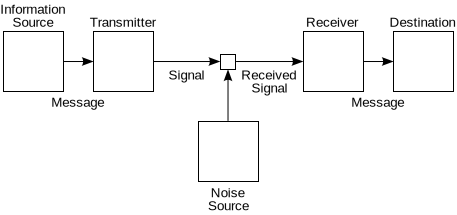

A number of authors have noted that digital preservation involves ensuring we can communicate with the future [TBA], and have explored preservation issues from that perspective. 

> "Digital traces as intentional and unintentional communication"
> "Digital curation as communication mediation"
>
> <small> Cal Lee, [Digital Curation as Communication Mediation](http://www.ils.unc.edu/callee/p507-lee.pdf)</small>

----

> "A layered communication model"
>
> <small>[Digital preservation as communication with the future](http://ieeexplore.ieee.org/xpl/articleDetails.jsp?arnumber=5201104)</small>

----

> "The proof that the preservation environment preserves authenticity and integrity while performing the communication constitutes a theory of digital preservation."
> "The definition of standard rules, standard micro-services, standard operations, and standard persistent state information provided by iRODS can lead to a theory of digital preservation."
> <small>[Towards a Theory of Digital Preservation](http://www.ijdc.net/index.php/ijdc/article/viewFile/63/42)</small>

----

> "...the preservation problem becomes in many respects similar to a communication problem between two agents and its recursive character is eliminated..."
> <small>[Some Preliminary Ideas Towards a Theory of Digital Preservation](http://www.ics.forth.gr/isl/publications/paperlink/DLF107.pdf) - seems to aim to 'solve the problem', rather than model the world.</small>

----

> "Here I want to go a step further and suggest that the preservation of digital objects is logically inseparable from the act of their creation — the lag between creation and preservation collapses completely, since a digital object may only ever be said to be preserved if it is accessible, and each individual access creates the object anew. One can, in a very literal sense, never access the "same" electronic file twice, since each and every access constitutes a distinct instance of the file that will be addressed and stored in a unique location in computer memory."
> <small>[Matthew Kirschenbaum](https://twitter.com/mkirschenbaum), [The .txtual Condition](http://www.digitalhumanities.org/dhq/vol/7/1/000151/000151.html)</small>

This series argues that this is much more than simply illuminating point of view, asserting that information science and communication theory form the fundamental basis of digital preservation. The aim here is to explore the consequences of that assertion. In contrast to much of the material in these approaches, I'm going to steer away from interpretation and abstract modelling, and instead attempt to focus on describing real examples, engineering practices, and established theories.

By treating communication theory as our starting point, we can trace out the beginnings of such a theory. On the way, we can explore the relationship between digital and analogue signals, and the ways in which the limits of computability place limits on what we can knowingly preserve. We can outline the relationship between signals and noise, and from there start to see the relationships between compressibility, artificial intelligence, and representation information. We will examine some of the ways in which current digital preservation practices and built on algorithms and processes that have their roots in information science and on a continuum of engineering practices, extending from the shortest to the longest time scales.

The relationship between digital preservation and the well-established field of communication theory.'theory of digital preservation' must be consistent with established principles of information science.

To begin this journey, we must start by defining [the Zeroth Law of Digital Preservation](The Zeroth Law of Digital Preservation.html).

The Zeroth Law
--------------

In the field of [thermodynamics][1], there was a law so obvious, so taken for granted, that no-one even realised it could be considered a law. The notion of thermal equilibrium - roughly speaking, the notion that a 'temperature' could be defined at all - was so fundamental that it simply assumed without question. Later, if became clear that the first, second and third laws of thermodynamics were not strictly consistent unless this axiom was added. The primacy of this assumption was recognised formally by calling it the [zeroth law of thermodynamics][2].

I believe that the field of digital preservation has followed a similar path, and that the mathematical theory of communication that began with [Claude Shannon's][3] [seminal work from the 1948][4] is so fundamental to every single digital preservation system and concept we have been using. In short, that Shannon's [noisy-channel coding theorem][5] should be considered our Zeroth Law.

An information source that produces a message
A transmitter that operates on the message to create a signal which can be sent through a channel
A channel, which is the medium over which the signal, carrying the information that composes the message, is sent
A receiver, which transforms the signal back into the message intended for delivery
A destination, which can be a person or a machine, for whom or which the message is intended

Set the scene, describe source coding theorem, and describe our 'channels'. 

...

Source coding theorem as backbone of what we already used, lead into what it tells us about preserving information if we consider a format migration 'channel'.

But this applies to everything - even the 'discrete' form applies as much to text and morse code as it does to WAV files and HTTP. So, [what's so special about digital preservation?](What is Special About Digital Preservation.html).

What's So Special About Digital Preservation?
---------------------------------------------

It's not the digital that's the problem
Directly.
It just makes new machines easy.

OR

Software is the only thing that distinguishes 'digital preservation' from any other discrete, symbolic communcation system (from Morse Code to the written word).

Something about computing and green and brown field development. 
Moving into cities built on cities.

Broadcast to narrowcast - no longer a property of the medium.

Then point out that that the other part of the theoretical underpinnings is that the comms is done using computers, so that Turing applies, etc. Refer to Validation page.

So, the critical thing is the Turing machine, and practically, this means software is at the heart of it. 

Expression, manifestation, inflation, reification, actualisation, act.
No word in any glossary for this, the run-time representation of the digital object.

Von Neumann Machines
--------------------

The important of the von Neumann architecture. The separate of data and code underpinning the entire concept of data that can be separated and made portable etc.

Also, this is archetypical of the engineering decisions that underly the technologies we are attempting to preserve. That understanding the technology is one part, but understanding use, adoption, is critical to understanding preservation.

But separable code and data is only the beginning. The buildings of our software machines have already discovered that raw machine code and binary data and not necessarily the best way of maintaining access, even to their own systems. To understand that, we need to dip into another part of information theory - formal languages.

Code as Communication
---------------------

Describe the interpretation v. representation problem again. It is possible to do absolutely anything with a computer using only machine code, but it has not proved a easily interpretable construct. Cray and his toggle switches. The engineers sought a middle ground, a language precise enough to be turned into machine code, but approachable enough that the meaning of the program might be understood. i.e. there is a communication story here, with the source code communicating a slightly different set of things, with some room for error. 

Define the formal languages, describe the Chomsky heirarchy briefly, to refer back to in a subsequent section.

Also, what about persisting the state of the programs, which is where we get interesting.

Also sufficiently isolated from technical details, vector of cross-platform comms. It is in this context that the first digital 'formats' start to appear [citation needed what about physical digital formats?]

The Digital Object Dichotomy
----------------------------

Outline the fundemental confusions that arise from two distinct conceptions - bitstream and performance. The truth is inbetween, as both are projections of the true object, the bytes in flight.

The Stack

That all digital objects are processes, and that the artefact is an analogue relic.

In truth, every so-called digital object is a process, not state. The illusion of stillness has taken years to create, but is a kindly lie.

Bytes in flight. etc.

A more technically focused approach to digital preservation is described by Thibodeau in [10]. This work identifies three layers of meaning for a digital object: every digital object is a physical object, a logical object or a conceptual object.

That all digital objects are processes, and that the artefact is an analogue relic.

That the difficulties in preserving access to digital media arise primarily because the access the item is mediated, not because they are digital. The same can be said of needing a speaker of an obscure language to understand a book. You can either keep the language alive (emulation), or translate the book (migration).

Save As...
----------

The early computers had little or no permanence. 
Tape, pushing memory to disk.
Early persistence and communication, Yellow Pages listings in computer magazines.
That the road to perpetuity is made of daily steps.
That we should understand how preservation is done, right now, on a day-to-day, week-to-week, year-to-year level, because the only way to reach out across centuries is by changing the day-to-day.

This is not a digital object
File bitstream resource-content
They are the first step to presrvation
Persistant state

The First Preservation Action, 

A model which does not include such basic operations as 'saving' and 'loading' cannot be sophisitcated enough to describe what ahppens.

LINK TO [Codes](codes.html) ??? (Chomsky) 
No, not yet.

### Edit notes

So, this section lays basic theoretical groundwork, and touch upon all the main existing areas that will be referenced elsewhere. It starts with introducing Shannon, and ends by describing basic bitstream-based persistence in those terms.

Follow-on sections break this down:
- Codes, i.e. Chomsky heirarchy and its applications.
- Siginificant Properties paradox and resolution (possibly part of the above).
- Siginificant Properties and [Common Carrier](https://en.wikipedia.org/wiki/Common_carrier) status.
- Validation and the Halting Problem.
- Entropy, Compression and RI

Illustrative Asides:
- Press Any Key
- What Are We Editing

Dealing with Value
- Not A Science
- Realistic Risks
   - http://activehistory.ca/2014/07/where-have-all-the-censuses-gone-a-problem-with-digital-data/ etc.
- Making Plans
- Never Alone (social aspect)

Broken bits
- [Pixel Dust: Illusions of Innovation in Scholarly Publishing by Johanna Drucker](http://lareviewofbooks.org/essay/pixel-dust-illusions-innovation-scholarly-publishing/) features a number of points that are, at best, ill-defined.
- [File Format Actions Plans](http://blogs.loc.gov/digitalpreservation/2014/01/file-format-action-plans-in-theory-and-practice/) and paying for just-in-case preservation actions (what are the costs).

Fundamentals of DP
- The Zeroth Preservation Action: Save As...
- Significant Property Schemes 
- Data And Metadata
- The Stack
- Migrations And Emulations
- Choosing the performances: wikipedia black out case study
- Halting problem and the space of all future models equals the no superset problem
- CAP Theorem and consequences : http://queue.acm.org/detail.cfm?id=2610533 etc.

http://www.avpreserve.com/blog/the-100-year-lie-and-the-lay-of-the-shelf/

[1]: https://en.wikipedia.org/wiki/Book:Thermodynamics
[2]: https://en.wikipedia.org/wiki/Zeroth_law_of_thermodynamics
[3]: https://en.wikipedia.org/wiki/Claude_Shannon
[4]: https://en.wikipedia.org/wiki/A_Mathematical_Theory_of_Communication
[5]: https://en.wikipedia.org/wiki/Noisy-channel_coding_theorem

