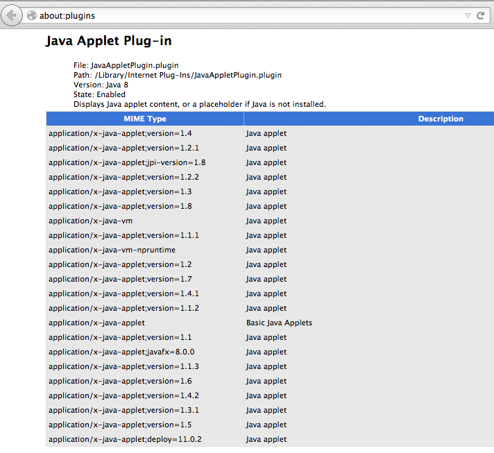

Introduction
------------

In digital preservation, at the most basic level, we need to be able to associate digital resources with the software that is required to make the content accessible. Most commonly, this is achieve by identifying the format of a bitstream. Therefore, we need to be able to clearly and unambiguously talk about formats, and we must endeavour to ensure that this clarity persists over time.

Talking In PRONOM
-----------------

There are a few different formal frameworks for talking about formats, but the most well-known and well-respected one intended for digital preservation is [PRONOM](http://apps.nationalarchives.gov.uk/PRONOM/). But the interesting thing about PRONOM is that it is, in a sense, only half the language we need. It gives us an explicit enumeration of 'nouns' (i.e. format definitions), but the 'grammar' that controls how those nouns should be applied is less clear.

At first, however, this looks straight-forward. When running the DROID command-line tool, the result of the identification is reported as in the 'Format' column for each file. Similarly, in PREMIS v2, PRONOM format identifiers (PUIDs) are used to declare the &lt;premis:format> for a given bitstream ([see here for an example](https://github.com/flazz/schematron/blob/master/spec/instances/premis-in-mets/good.xml#L35)). In summary, if we might say our 'grammar' is simply:

    <bitstream> .hasFormat. <PUID>

All well and good.

Until you hit the edge cases.

### Multiple Matches ###

The most common edge case, which many of us have experience, is when DROID can't give a single definitive answer, but instead returns multiple matching PUIDs. For example, until 2010, PRONOM used four separate records to describe the TIFF format, one for each of the known distinct versions of TIFF (versions [3](http://apps.nationalarchives.gov.uk/pronom/fmt/7), [4](http://apps.nationalarchives.gov.uk/pronom/fmt/8), [5](http://apps.nationalarchives.gov.uk/pronom/fmt/9) and [6](http://apps.nationalarchives.gov.uk/pronom/fmt/10)). However, DROID cannot distinguish between these different versions when analysing a given bitstream, and so when passed a TIFF, it returned a list containing all the possible TIFF format identifiers:

    <bitstream> .hasFormat. <fmt/7>
    <bitstream> .hasFormat. <fmt/8>
    <bitstream> .hasFormat. <fmt/9>
    <bitstream> .hasFormat. <fmt/10>

At this point, our initial grammar becomes ambiguous. For example, the above assertions could be taken to mean either of:

    <bitstream> .hasFormat.
        ( <fmt/7> AND <fmt/8> AND <fmt/9> AND <fmt/10> )

    <bitstream> .hasFormat. 
        ( <fmt/7> OR <fmt/8> OR <fmt/9> OR <fmt/10> )

In this case, because we know that DROID cannot distinguish the distinct TIFF versions, we might assume that the latter ('OR') is the case. However, it is easy to imagine cases where 'AND' might be useful. For example, a GeoTIFF is also a TIFF, and a DOCX is also a ZIP, and many file formats can also be interpreted as plain text.  Unless we extend the grammar, we cannot distinguish between these two cases.

This way of handling TIFF versions caused a lot of confusion, and so in [release 51](http://www.nationalarchives.gov.uk/aboutapps/pronom/release-notes.xml) the decision was taken to create a new generic [TIFF PUID](http://apps.nationalarchives.gov.uk/pronom/fmt/353), and to deprecate the separate identifiers so that DROID would return only the new PUID. However, the deprecation of PUIDs that have already been applied to many thousands of digital objects also [caused some consternation](http://www.openplanetsfoundation.org/blogs/2011-08-28-fmt-78910).

### Has Format? ###

Unfortunately, the decision to allow multiple matches for format families leads to deeper problems concerning the semantics of `.hasFormat.`. The implication of the `.hasFormat.` relationship is that this is a statement of an attribute of the bitstream. But while DROID may be uncertain, the bitstream itself can definitely only be encoded in one version of a format, which may or may not be compatible with other version. 

For example, if a bitstream uses TIFF 6 features, it is not a TIFF 3, therefore the assertion that the bitstream `.hasFormat.` TIFF 3 is simply wrong. But if it is only using TIFF 3 features, then it could reasonably be said to be TIFF 3 AND 4 AND 5 AND 6, because each successive TIFF format was a superset of the previous version. However, this is only true for backwards-compatible formats, and so the use of multiple format identifiers should reflect the nature of the formats themselves rather than DROID's inability to distinguish similar formats.

In short, the `.hasFormat.` grammar cannot distinguish between DROID's uncertainty and format compatibility, and so it's interpretation is ambiguous.

#### Interpreting Polyglots ####

The notion of format compatibility can be stretched even further by trying to describe [polyglots](http://en.wikipedia.org/wiki/Polyglot_%28computing%29): bitstreams that are simultaneously interpretable as *two or more* distinct formats. Polyglots are most commonly designed to be interpreted as more than one programming language, but the concept has also been extended to binary data formats (sometimes referred to as "binary polyglots").

Examples include [this HTML file](http://lcamtuf.coredump.cx/squirrel/), which transcludes a copy of itself when rendered, at which point it is interpreted as a JPEG image (see [this discussion for more information](http://stackoverflow.com/questions/11587119/is-this-a-web-page-or-an-image)), and [this collection of carefully constructed polyglots](https://code.google.com/p/corkami/wiki/mix). The latter collection includes three files that are valid Windows, Linux and OS X binaries respectively, but where each of those binary executables is also a working PDF document, a Java Jar file (zip + class + manifest), and a HTML + JavaScript file. 

Clearly, the assertion of format is a statement about how a bitstream *might* be interpreted, rather than an objective assertion about the nature of the bitstream itself -- the concept of `.hasFormat.` is not enough.

### Non-format Identifiers ###

There are also a number of other situations and classes of digital entity that we can come across during identification, and it is reasonable to ask whether a suitable format language should cover these. 

For example, a recent posting to the [digital preservation Q&A site](http://qanda.digipres.org/) explored whether there [should there be a PRONOM ID for unidentifiable/unidentified?](http://qanda.digipres.org/181/should-there-be-pronom-id-for-unidentifiable-unidentified). As I stated in my answer to that question, there are a number of states beyond just 'unidentified' that it may be worth minting identifiers for, so we can talk about them more easily. They include:

* Folders
* Empty files
* [Soft/symbolic links](http://en.wikipedia.org/wiki/Symbolic_link) 
* [Hard links](http://en.wikipedia.org/wiki/Hard_link)
* Various classes of [block device](http://en.wikipedia.org/wiki/Device_file)

The other answers to thtat question make it clear that the solution employed by PRONOM and DROID is to add a separate field for each case of interest. he PUIDs are only to be applied to bitstreams of non-zero length, while additional data fields are used to record whether something is a folder, or to record the length of the bitstream. 

This is, of course, a perfectly reasonable approach. However, if we design a format language that subsumes these additional fields into a single consistent explicit form, it will make it easier to communicate and preserve that information. 

### Comparing & Describing Tools ###

There are a range of tools that perform format identification, and it would be very useful to be able to compare the results from different tools, in order to work out how best to exploit or combine them. However, as only DROID uses PUIDs, we need a more general language in order to enable us to directly compare its results against those of other tools.

Similarly, we would like to be able to look up which tools can read or write different formats. A richer format language would make it easier to describe tools and processes and make them more easily discoverable.

### Scaling Up ###

When working with web archives, we are exposed to a very wide range of formats. Even in less varied collections, we can expect the number of different formats involved to increase over time. Furthermore, it seems reasonable to expect that the degree of sophistication with which we wish to describe these formats is also likely to increase, as we consider different combinations of factors that affect how the bitstreams may be interpreted. 

To understand how well PRONOM scales up to meet these challenges, we need to look at how new format identifiers are created (or 'minted').  PRONOM's [PUIDs](http://www.nationalarchives.gov.uk/aboutapps/pronom/pdf/pronom_unique_identifier_scheme.pdf) are defined as a linear sequence of distinct identifiers, where each one must be manually created and assigned as new formats are identified, according to a [careful development process](http://www.nationalarchives.gov.uk/documents/information-management/pronom-file-signature-research.pdf). This certainly provides a strong basis for formal identification, but this linear workflow also acts as a bottleneck when scaling up, for two separate reasons.

Firstly, this design means that if we restrict ourselves to using only PUIDs, we cannot talk about a format until a PUID has been minted for it. This may seem both trivial and insurmountable, but in fact identifier schemes are often user-extensible. Windows developers are free to create new file extension associations, OS X developers are free to [declare new Uniform Type Identifiers](https://developer.apple.com/library/ios/documentation/FileManagement/Conceptual/understanding_utis/understand_utis_declare/understand_utis_declare.html#//apple_ref/doc/uid/TP40001319-CH204-SW1), and Internet Media Types provide [three different extension mechanisms](http://en.wikipedia.org/wiki/Internet_media_type#Vendor_tree).

Of course, it is perfectly reasonable not to mint *permanent* identifiers in these cases, but by embedding PUIDs in a more general format language we allow for a smooth transition from 'transient' identifiers (which may retain their meaning for a small number of decades) to using formal permanent identifiers.

The second and more serious scaling issue for PUIDs is how we handle combinations of different aspects of format. If we take an MP4 video as an example, we know that just calling it an MP4 does not really tell us enough to interpret the object, because MP4 is a container format. An MP4 can contain various numbers of audio and video streams, each using one of a range of distinct codecs. If we imagine attempting to mint a separate PUID for every possible combination of codecs and streams, we would require a potentially massive number of distinct records, and this number would accelerate exponentially with the number of distinct encoding options. 

The case of text encodings is similar -- creating distinct identifiers for each possible encoding for every plain text format would require many thousands of PUIDs. Given that PRONOM has a separate identifier sequence for character sets (e.g. [UTF-8 is chr/1](http://apps.nationalarchives.gov.uk/pronom/chr/1)) it would seem that the PRONOM designers recognised this issue, but the `chr/XXX` identifier namespace is not well known and the grammar by which these were intended to be combined with the format identifiers is not clear.

A Extensible Format Identification Scheme
-----------------------------------------

Most, if not all of the issues outlined above have been raised previously, and a there have been a number of proposals for possible solutions. However, these solutions have generally taken the form of entirely new format registry designs and/or implementations, built by independent groups and then presented to the wider digital preservation community.  None, so far, have succeeded.

The reasons for this are not clear, but I would propose that one important omission has been the failure to adequately investigate who the actual users are[^1]. Critically, it has not been clear who will be spending their time filling these registries, and who will be using that information, and if these are always the same people doing both the reading and the writing, or if this resource is intended to help inform and educate an audience of 'less technical' users. It is surely nigh-on impossible to design an acceptable user experience in the absence of users, or to build a crowd-sourcing system without getting to know the crowd.

The problem of where to get the data from has also led to another issue. Many new format registries start be copying in or partially duplicating the contents of PRONOM, but without dealing with the fact that this will always be a mere point-in-time snapshot. The burden of data maintenance and synchronisation is rarely even acknowledged, never mind adequately addressed, and is utterly critical to the long-term sustainability of the system.

More recent attempts have focussed on using a linked data framework to combine data sources. This is certainly a potentially powerful approach, but it does not make the issue to data maintenance go away entirely. The freedom to combine arbitrary schemas is also the freedom to make an almighty mess. Some shared practices and procedures will be required in order to ensure the data remained interoperable between the various data sources, and that the semantics of those assertions remain clear and do not fall into contradiction.

Here, we take a simpler, less ambitions approach. Our goal is not to create the perfect extensible permanent identifier system, but rather to combine existing format systems together in order to create a kind of format *lingua franca* for the short to medium term[^2]. Crucially, the design embeds PRONOM as-is, inside a broader format language, and does not attempt to replace, clone or supersede it. As PRONOM evolves, the precise linkage between the languages may shift, but the overall integration will remain useful and understandable.

### Resolving The TIFF Troubles ###

Among the reactions to the decision to deprecate the version-based TIFF identifiers[^3], one [concrete proposal for resolving the issue](http://www.openplanetsfoundation.org/blogs/2011-08-28-fmt-78910) was to add a *parent-child* relationship to PRONOM. The new TIFF identifier could act as a *super-class*, with each of the versioned identifiers being a *sub-class*. The original meaning of those identifiers would remain clear, and identification tools could report their finding at whatever level of granularity was appropriate.

This idea is common to a number of format identification schemes. In the context of Apple Uniform Type Identifiers, this is referred to as [the conformance hierarchy](https://developer.apple.com/library/ios/documentation/FileManagement/Conceptual/understanding_utis/understand_utis_conc/understand_utis_conc.html#//apple_ref/doc/uid/TP40001319-CH202-BCGJGJGA). On the Linux desktop it is referred to as [subclassing](http://standards.freedesktop.org/shared-mime-info-spec/shared-mime-info-spec-latest.html#subclassing), which generalises the format class relationships already implied by the MIME type system. This generalisation is formalised and standardised by the [MIME Info Specification](http://standards.freedesktop.org/shared-mime-info-spec/shared-mime-info-spec-latest.html), managed by the [freedesktop.org interoperability project](http://www.freedesktop.org/wiki/Specifications/shared-mime-info-spec/). As well as being used by most Linux distribution vendors, the MIME Info specification also forms the basis of the [Apache Tika binary format identification engine](http://tika.apache.org/1.5/parser_guide.html#Add_your_MIME-Type)[^4].

### Extended MIME Types ###

The core idea, therefore, is quite simple. Lets take the MIME type model, as defined in the MIME Info specification, and use the built-in extension points to link the [IANA MIME types](http://www.iana.org/assignments/media-types/media-types.xhtml) to the PRONOM definitions. For our purposes, the most important extension mechanism is the concept of [MIME type parameters](http://en.wikipedia.org/wiki/Internet_media_type#Naming), whereby a base format can be refined using a series of attributes in the form of *key-value* pairs.

Indeed, there are already a number of existing MIME type parameters that are use to cover cases of interest, and in those cases, we can simply formalising conventions that are already in place. For example, here is already a mature specification for describing [video codecs](http://wiki.whatwg.org/wiki/Video_type_parameters), e.g. a Quicktime VR file can be described as:

    [ video/quicktime; codecs="cvid, pano" ]

If we do want to be able to identify the contents of A/V container formats, this is surely an excellent place to start.

Another convention is to use the `version` parameter to distinguish between different versions of the same format. For example, the Firefox browser uses this parameter to describe which Java versions the plugin can execute:

In fact, formalising the `version` parameter is all we need to link up with PRONOM.

### Building with PRONOM ###

From the PRONOM side, the link can be made because PRONOM already contains a MIME type field, and it is filled out for the majority of formats. Therefore, to generate an interoperable MIME type, we can simply combine the data from the MIME and Version fields and produce a unique MIME type for each PUID. For example, [PNG 1.2](http://apps.nationalarchives.gov.uk/PRONOM/Format/proFormatSearch.aspx?status=detailReport&id=666) has a MIME type of `image/png` and a Version of `1.2`, yielding the extended MIME type:

    [ image/png; version="1.2" ]

All of the PRONOM records with MIME types can be mapped unambiguously to this extended form, either directly onto an existing MIME type or (more usually) by using the version field to distinguish formats in the same family.

Of course, some PUIDs do not have MIME types, but in this case we an use the MIME `x-` extension mechanism to define MIME type mappings for each one[^5]. For example, at the time of writing, the [entry for HTML5 (fmt/471)](http://apps.nationalarchives.gov.uk/PRONOM/Format/proFormatSearch.aspx?status=detailReport&id=1258) does not include the MIME type in the record. In this case, we mint a special custom type:

    [ application/x-puid-fmt-471 ]

Which is sufficient as to ensure interoperability with the broader framework. However, we can also use the other PRONOM data to add some addition information to help us understand what's happened:

    [ application/x-puid-fmt-471; name="Hypertext Markup Language"; version="5" ]

This mapping instantly clarifies what has been going on, and we can continue our work irrespective of when or whether the PRONOM record is updated.

### Hierarchy & Ambiguity ###

Having generated these mappings, we can now explore how the *subclass* mechanism described above works in practice. For the PNG example, we can now map out the full hierarchy:

 * `application/octet-stream`
     * `image/png`
         * `image/png; version="1.0"`
         * `image/png; version="1.1"`
         * `image/png; version="1.2"`

As per the MIME info specification, all bytestreams can be considered raw `application/octet-steam` data, and so all formats have this as the root class.  Similarly, all the different versions of PNG are a part of the `image/png` class. If a given identification tool cannot distinguish between the versions, it can return the `image/png` superclass, while still allowing that result to be combined with the results of a tool that can make that distinction.

Similarly, all text formats are subclass of `text/plain`, so we have structures like:

 * `application/octet-stream`
     * `text/plain`
         * `application/rtf` (also known as `text/rtf`)
             * `application/rtf; version="1.0"`
             * `application/rtf; version="1.1"`
             * `application/rtf; version="1.3"`
             * ...

So, when we identify a format of a bytestream, we know that the bytestream also conforms to all the formats higher up in the tree (e.g. `image/png AND application/octet-stream`). If the returned format has known subclasses, we know that this means the tool cannot distinguish between them.

### Aliases ###

The MIME Info specification also permits known alias for a given type to be captured. For example, PRONOM records the MIME type of Rich Text Format to be `text/rtf`, but the [IANA media type registry records it as `application/rtf`](http://www.iana.org/assignments/media-types/application/rtf) (see also the [proposed deprecation of `text/xml`](http://tools.ietf.org/html/draft-murata-kohn-lilley-xml-03)). Aliases allow us to describe this relationship without having to force the two registries to agree before we can proceed.

The much the same way, the alias mechanism also allows us to merge the `application/x-puid...` identifiers (the ones we created for records with no MIME type) into full format hierarchy. For example, we can record that:

    [ application/x-puid-fmt-471 .isAliasFor. text/html; version="5.0" ]

and so resolve the discontinuity between the two systems.

### Formats With No PUID Or Media Type ###

This flexibility also allows us to consider minting other classes of format identifier and linking them in. In particular, we can invent a scheme for describing formats which have no known media type or PRONOM ID, but for which we do know the file extension.

While the file extension is not generally considered a 'preservation worthy' identifier, it is immensely useful the short term. Almost every common operating system relies on file extensions to maintain the association between files and the software that acts upon them, and indeed in the context of personal digital archiving it should usually be considered the most authoritative source of information about the intended interpretation of a given file. 

Of course, some formats do have the same extension, and in those cases the meaning can be ambiguous. But most extensions are distinct, in that they can be used to associate a family of format versions with the set of software that may be able to interpret them. Therefore it is useful to be able to integrate these identifiers with the wider set, so that we can talk about this formats while we await the creation of more permanent identifiers.

Like the `version` parameter described above, the developers of Firefox have already considered this possibility, and can support identifiers of the form:

    [ application/x-extension-{EXT} ]

Again, we can exploit this existing convention by formalising it and mapping them in as aliases.

### From Format To Conformance ###

The hierarchy of formats also suggests a way to resolve the problems with the `.hasFormat.` assertion. If we replace `.hasFormat.` with `.conformsTo.`, we end up with a format language that captures complex cases much more robustly. For example, if we have a TIFF 6 bitstream, we might say:

    <bitstream> .conformsTo. [ image/tiff; version="6" ]

but for a TIFF 5 bitstream, we could reflect the forward compatibility of the format by asserting conformance across the full range of formats:

    <bitstream> .conformsTo. [ image/tiff; version="5" ]
    <bitstream> .conformsTo. [ image/tiff; version="6" ]

Even polyglots could be addressed in this fashion, as the HTML and JPEG example mentioned earlier could be described as follows:

    <bitstream> .conformsTo. [ image/jpeg ]
    <bitstream> .conformsTo. [ text/html ]

### Describing Tools ###

As well as being able to describe the formats of bitstreams, this approach can also be used to describe tools that act upon formats (indeed, this approach was partially refined during my involvement in [the SCAPE project](http://www.scape-project.eu/), where [tool specifications](https://github.com/openplanets/scape-toolspecs) are used to describe the available preservation actions). 

Rather than being forced to enumerate compatible format versions using PUIDs, the conformance hierarchy in the MIME Info approach allows tools to be defined as compatible with whole format families. This makes discovery of potential tools more robust, and the tool metadata required less maintenance over time. When evaluation options, it is more convenient to have a  chance of a false positive (tools that can't yet cope with a new format feature) than to have false negatives (a tool you never even find out about because the tool metadata hasn't been updated).  Of course, the same basic language could also be used to describe particular members of a format family that are known to cause issues (that is, it is more convenient to say 'all versions of PDF except 1.7' than to have to enumerate the versions  that are known to be supported).

An additional potential advantage of adopting a MIME types to describe tools and processes is that they are the native format description language of the web. Wherever a HTTP request uses a standard MIME types, it could instead employ extended MIME types. For example, in a RESTful microservice architecture, it would be trivial to develop web service that employ [content negotiation](http://www.w3.org/Protocols/rfc2616/rfc2616-sec12.html) to allow clients and servers to distinguish between different versions of a format. By creating microservices that work at the same level of granularity as PRONOM (or finer!), we allow carefully-designed preservation operations to run over standard web tools and protocols.

### Comparing Tools ###

Finally, as indicated early, as many tools support MIME types, mapping experimental results into that form makes it much easier to compare the results of different [identification tools](http://coptr.digipres.org/Category:File_Format_Identification). As well as [DROID](http://coptr.digipres.org/DROID_(Digital_Record_Object_Identification)), [Apache Tika](http://coptr.digipres.org/Apache_Tika), [file](http://coptr.digipres.org/Fine_Free_File_Command), and [FITS](http://coptr.digipres.org/FITS_(File_Information_Tool_Set)) all have options to provide MIME types as output. 

Even in the absence of 'ground truth' data, running multiple identification tools over the same corpus and combining the results has proven to be a powerful way to compare tools and reveal their relative strengths, limitations, and provides a drive to resolve any inconsistencies.  In particular, the [Formats Over Time](http://www.webarchive.org.uk/ukwa/visualisation/ukwa.ds.2/fmt) work, based on the multi-tool format profile of 1996-2010 UK historical web archive, has proven very useful and will form the basis of future work.

Current Implementation
----------------------

As the previous section implies, this extended MIME type scheme is not an abstract plan, but has already been implemented and is currently in use at the UK Web Archive. Apache Tika forms the basis of the approach, as it has [an easy mechanism for adding new signatures](http://tika.apache.org/1.5/parser_guide.html#Add_your_MIME-Type), can can cope with a mixture of [fine-grained](https://github.com/ukwa/webarchive-discovery/blob/warc-discovery-2.0.0/warc-indexer/src/main/resources/org/apache/tika/mime/custom-mimetypes.xml#L100) and [coarse-grained](https://github.com/ukwa/webarchive-discovery/blob/warc-discovery-2.0.0/warc-indexer/src/main/resources/org/apache/tika/mime/custom-mimetypes.xml#L135) format definitions.

In order to bring in the DROID results, and as part of the SCAPE project, a second component was developed, called [Nanite](https://github.com/openplanets/nanite). This is simply a minor reworking of the core of the DROID identification engine, with all of the databases and frameworks stripped away, and adding support for operating on streams of input data rather than just files. This makes it easier to embed in other projects, and allows it to operate at scale as a Map-Reduce task on the Hadoop platform.

As Tika already defines a [suitable interface for format identification tools](http://tika.apache.org/1.5/api/org/apache/tika/detect/Detector.html), Nanite simply wraps DROID so that it conforms to that API. Under the hood, once the DROID core has determined the PUIDs, the results are processed by a [DROID to MIME type mapping](https://github.com/openplanets/nanite/blob/master/nanite-core/src/main/java/uk/bl/wa/nanite/droid/DroidDetector.java#L380) that operates as described above, and the resulting extended MIME type then forms the final result. 

Building on the *Formats Over Time* work mentioned earlier, this approach of combining multiple identification results has been built into the (UK Web Archive full-text indexing system](https://github.com/ukwa/webarchive-discovery). We have successfully run this process over billions of distinct resources, and are investigating ways of exposing this information to digital format researchers via our search interface.

Limitations
-----------

The extended MIME types provide a convenient, extensible and scalable way of defining formats, and the addition of a format hierarchy helps to reduce the complexity of the grammar we need to describe the format of bitstreams.  Furthermore, by shifting from`.hasFormat.` assertions to `.conformsTo.`, we can accurately describe a wider range of formats in a coherent grammar, even including polyglots[^6].

As stated earlier, extended MIME types do not come with guarantee of permanence, and so may not be considered suitable for archival purposes. However, it is not clear whether this argument will stand up to scrutiny. Firstly, identification tools will always lag behind the latest format developments, and we are likely to wish to continuously developer the degree of finesse with which we describe the formats of bitstreams and the features they depend upon. Active preservation of varied collections is going to involve running occasional re-identification processes and updating out metadata, so updating our identifiers will not be unusual. Of course, steps should be taken to ensure that any previous identifiers are not inappropriately re-used or have their meanings changed, but backwards-compatible changes (like adding new format subclasses) should not cause any issues.

Even where that is not the case, it is hoped that by using a practical and useful *lingua franca* for formats over the medium term, we would be able to efficiently explore the issues around developing a more permanent solution. This process could be driving by the data and our evolving needs, rather than abstracted reasoning about formats, and any future registry would be all the richer for it.

These issues reflect an underlying problem with this whole discussion -- we do not yet share a clear and concrete definition of what we mean by format. Combining different tools provides one way to explore those issues, as it brings disagreements about format definitions to the surface. However, to build interoperable systems, we are going to have to push for a shared model of [what we mean by format](defining-format.html).

<!--
    TODO: Add link to Interject once posted.
-->

Footnotes
---------

[^1]: Note that I mean actual, named humans you can talk to. You can't get feedback from an conceptual user class.
[^2]: Where by 'medium term' I mean the next decade or two.
[^3]: Some of the people involved in the discussions around this issue refer to it light-heartedly as "the TIFF tiff".
[^4]: It is also compatible with [the XML format used by Fido](https://raw.githubusercontent.com/openplanets/fido/master/fido/conf/formats-v77.xml), and could be used instead of Fido's custom schema.
[^5]: Note that [this extension mechanism is deprecated](http://tools.ietf.org/html/rfc6648), and a future iteration of this work should switch to [the x. extension mechanism](http://en.wikipedia.org/wiki/Internet_media_type#Unregistered_x._tree) or [a vendor tree](http://en.wikipedia.org/wiki/Internet_media_type#Vendor_tree).
[^6]: That said, `.hasFormat.` certainly covers the majority of cases, and so may be good enough in many cases, as long as we accept that it is an approximation and there will be some cases we simply can't capture. Certainly, in practice, we are likely to have to work with both forms of assertion for the foreseeable future.
